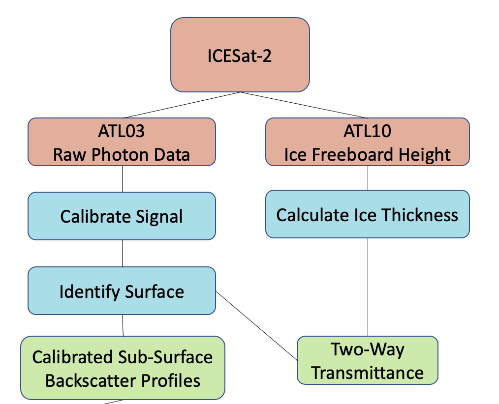
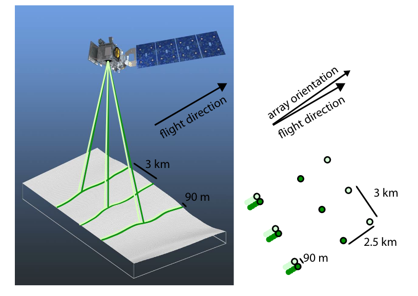

# ICESAT2_tools

This is a package under development as part of thesis work at the University of Rhode Island Graduate School of Oceanography. The objective is to identify under-ice Arctic phytoplankton blooms by calculating vertical profiles of the backscattering coeffcient. Basic workflow is as follows: 

## Notes on Parallel Processing

In order to process the ATL03 returns from relatively large sections of the Arctic over more than a week or so, computation really benefits from parallel processing. Here, I use the Dask python package on a remote HPC cluster. This will essentially prevent you from iterating over each individual ATL03 file in a for loop. Because each file is still processed seperately, 1 core is used per job. 

## Ice thickness data

Currently, along-track ice thickness is used from Alek A. Petty's ICESAT-2 Sea Ice Thickness repository, which relies on snow thickness and density data output by the NESOSIM model. Currently, these products are only available for the snow accumulation season (mid-August - late April). Future updates will focus on extending these records or using other methods to estimate ice thickness data during the spring and summer phytoplankton blooms.

## Photon Backscatter Data
The Advanced Topographic Laser Altimeter System (ATLAS) is the sole instrument on board the ICESat-2 satellite, launched by NASA in October of 2018. The instrument calculates time of flight for geolocated photons in six laser beams. Data is delivered in multiple post-processing packages, of which the ATL03 package provides the along-track distance, height of each photon relative to the WGS-84 ellipsoid, time, latitude, and longitude. (among many other things) Figure below from the ICESat-2 Algorithm Theoretical Basis Document for Geolocated Photons.

